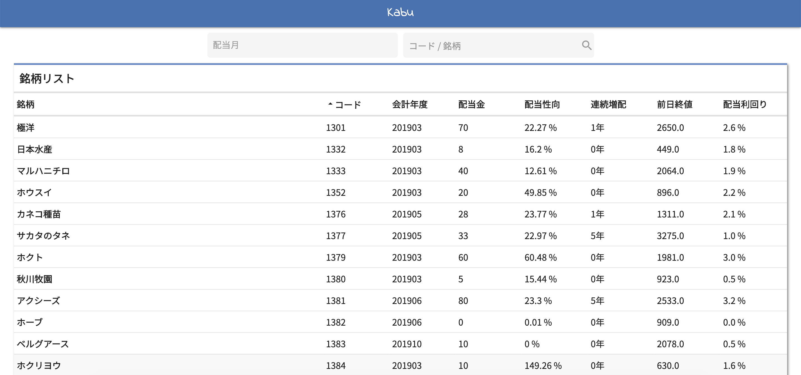
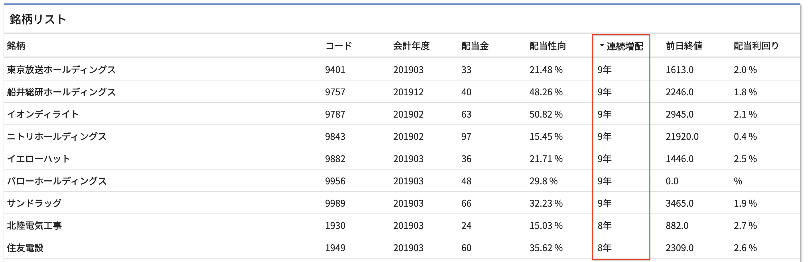
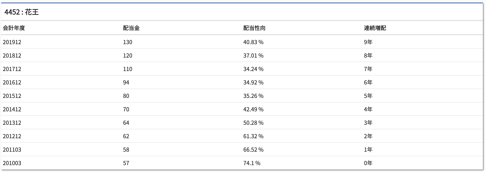

# サービス名
連続増配銘柄検索サービス

# サービスの目的と概要
株戦略の一つに増配を狙うというものがあります。
その中でも配当を毎年上げている銘柄が存在します。
このような銘柄を探すのを手伝うのが本サービスです。
連続増配株ベスト10のような記事はよく見るのですが、それ以外の株を見つけることができません。
本サービスを使うことで配当や連続増配銘柄が簡単に探すことができるようになります。

# サービスのコンセプト
とにかく無駄な機能は削ぎ落とし、連続増配株を探すことに特化させています

# サービスの使い方
## 起動手順
- 一旦ローカルでのみ利用可能です
  - ちょっと手順が多め
- Railsが動く環境を用意する
  - Ruby: 2.6.5
  - Rails:5.2.4.2
- `docker-compose up -d`
- `bin/setup_real_data`
- 前日終値を取得
  - `bundle exec sidekiq`
  - `rails c`
  - `StockRegisterJob.perform_async`
- `foreman s`
- [localhost:5000](http://localhost:5000)に接続

## 使い方
- トップ画面では銘柄と配当関係の項目を表示しています 
 
- 並び替えることで連続増配株を探すこともできます 
 
- 気になる銘柄があれば選択すると、配当金の伸び率を見ることができます 
 

# 開発環境
- Ruby on Rails
- Vue.js
- FLOCCS
- Materialize
- PostgreSQL

# その他
- APIモードでSPAでやればよかった
  - ローカル以外で動かす場合はJamstackがいいかもしれない

# Autohr
- [Github](https://github.com/naoto-koyama)
- [Qiita](https://qiita.com/naoto_koyama)
